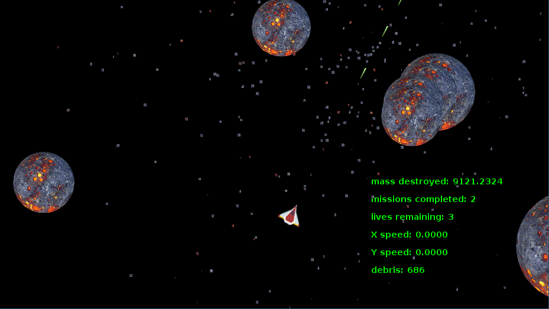

## Planetroids 




### Istruzioni
Il gioco planetroids e' fortemente ispirato al classico gioco Asteroid.

Si differenzia per la forma rotondeggiante degli asteroidi e per il fatto che quando 
un asteroide e' colpito si divide come se fosse una sfera, quindi in due sfere di dimensioni casuali
ma la cui somma dei volumi e' pari al volume di partenza.

Scopo del gioco e' ridurre tutti gli asteroidi di ogni missione in detriti e totalizzare il massimo punteggio
Gli asteroidi compaiono con dimensione casuale con distribuzione normale.
Il punteggio non conta gli asteroidi distrutti ma la corrispondente quantita' di massa proporzionale al volume, come se fossero delle sfere. 

La difficolta' delle missioni aumenta missione dopo missione:
- nella prima missione bisogna distruggere 3 asteriodi
- ogni missione il numero di asteroidi aumenta di uno
- ogni missione la velocita' degli asteroidi aumenta del 3%
- ogni missione la dimensione degli asteroidi diminuisce del 5%
- ogni missione la dimensione dei frammenti degli asteroidi (sotto la quale l'asteoride si polverizza in detriti) diminuisce del 2%

Comandi:

- **[INVIO]** avvia il gioco
- **frecce** per muoversi
- **barra** per sparare il laser
- **[F11]** entra/esce da modalita' full screen
- **[b]**  boss ;-)
- **[ESC]** esce dal gioco immediatamente


Comandi utili in fase di test / sviluppo

- **[c]** modalita' cheating
- **[n]** passa al livello successivo
- **[p]** passa al livello precedente


Comandi sperimentali 

- **[s]** abbassa il volume dei suoni
- **[S]** alza il volume dei suoni
- **[m]** abbassa il volume della musica
- **[M]** alza il volume della musica

### Architettura

La classe GameScene e' una classe di puri dati, che rappresenta il *mondo* del gioco, con tutte le entita', 
le scorie, i suoni.

Alla gestione del gioco concorrono 4 classi ciascuna con la propria responasbilita' e con il minimo accoppiamento 
tra di loro. 

- GameIntelligence gestisce la logica del gioco
- GameGraphycs aggiorna la grafica
- GamePhysic  gestisce prettamente le fisica del gioco
- GameMusic colonna sonora ed effetti


Il gioco e' un classico gioco con aggiornamento in un loop con frequenza di 60 FPS.
Il loop e' gestito dalla clase GameLoop.
La classe GameBuilder ha il compito di costruire le quattro classi fondamentali con le loro interdipendenze 
e inizializzare il game loop..

``` {.java}
        GameIntelligence gameIntelligence = new GameIntelligence(panel);
        GameGraphycs gameGraphycs = new GameGraphycs(panel,gameIntelligence.gameScene);
        GamePhysic gamePhysic = new GamePhysic(panel);
        GameMusic gameMusic = new GameMusic(gameIntelligence.gameScene);
        gameLoop = new GameLoop(gameIntelligence,gamePhysic,gameIntelligence.gameScene,gameGraphycs, gameMusic);
```

#### Domain model


#### Game Loop

``` {.java}
@Override
public void run() {
final int NANOSECONDS_PER_SEC = 1000000000;
final double TARGET_FPS = 60;
final double DRAW_INTERVAL = NANOSECONDS_PER_SEC / TARGET_FPS;

        long lastTime = System.nanoTime();
        long currentTime;
        int drawCount = 0;

        double nextDrawTime = System.nanoTime() + DRAW_INTERVAL;
        while (true) {
            currentTime = System.nanoTime();

            double remainingTime = (nextDrawTime - System.nanoTime()) / 1000000;
            update();

            if (remainingTime < 0) remainingTime = 0;
            try {
                Thread.sleep((long) remainingTime);
                nextDrawTime += DRAW_INTERVAL;
            } catch (Exception e) {
            }

        }
    }

    public void update() {
        gameIntelligence.processInput();
        gameIntelligence.update();
        gamePhysic.update(gameScene);
        gameGraphycs.update();
        gameMusic.update();
    }

    public void start() {
        Thread t = new Thread(this);
        t.start();
    }

```


