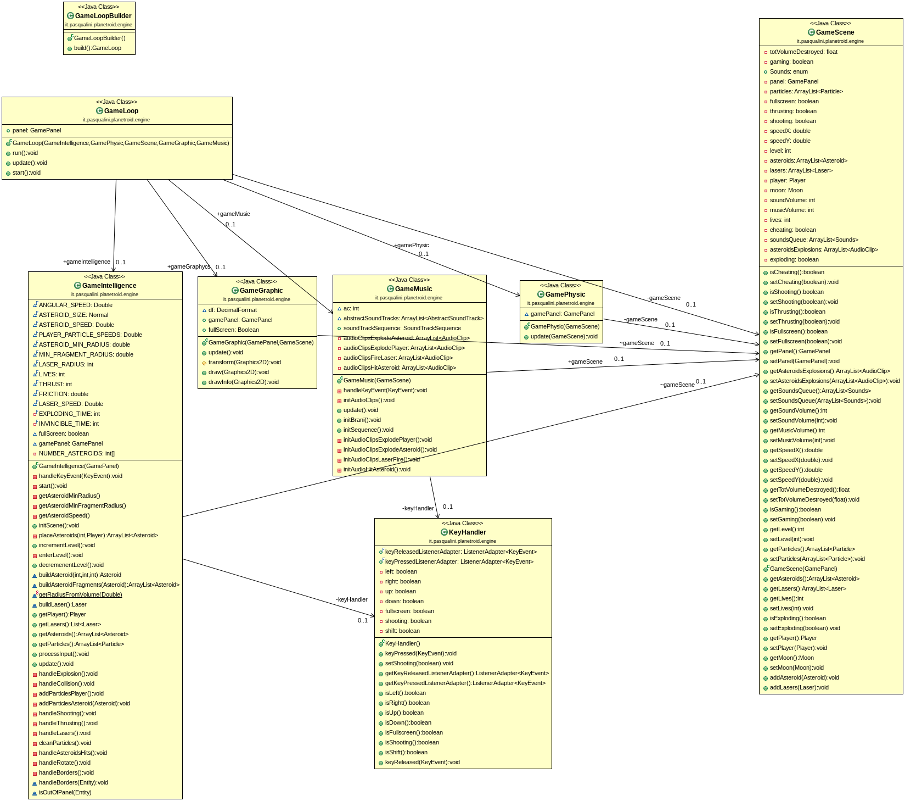
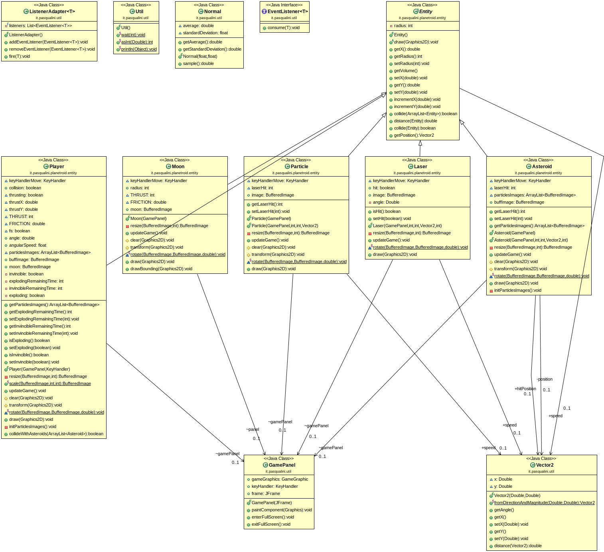
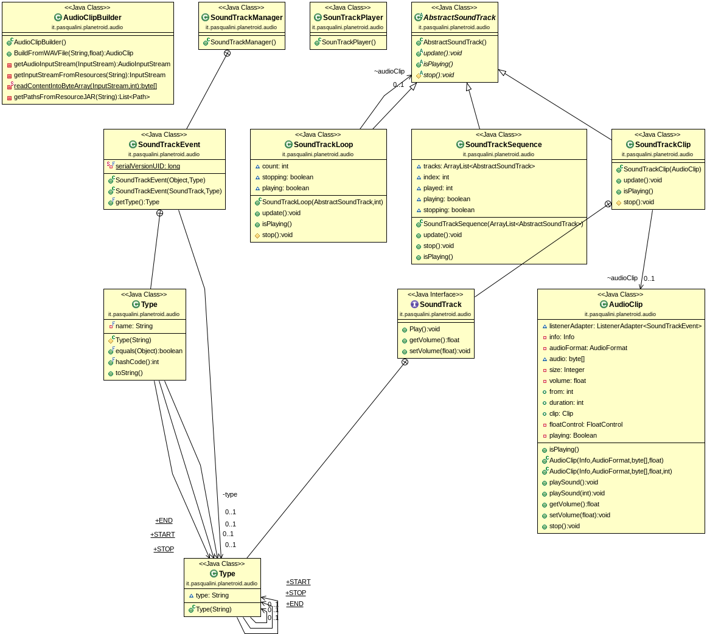

## Planetroids 


### Istruzioni
Il gioco planetroids e' fortemente ispirato al classico gioco Asteroid.

Si differenzia per la forma rotondeggiante degli asteroidi e per il fatto che quando 
un asteroide e' colpito si divide come se fosse una sfera, quindi in due sfere di dimensioni casuali
ma la cui somma dei volumi e' pari al volume di partenza.

Scopo del gioco e' ridurre tutti gli asteroidi di ogni missione in detriti e totalizzare il massimo punteggio
Gli asteroidi compaiono con dimensione casuale con distribuzione normale.
Il punteggio non conta gli asteroidi distrutti ma la corrispondente quantita' di massa proporzionale al volume, come se fossero delle sfere. 

La difficolta' delle missioni aumenta missione dopo missione:
- nella prima missione bisogna distruggere 3 asteriodi
- ogni missione il numero di asteroidi aumenta di uno
- ogni missione la velocita' degli asteroidi aumenta del 3%
- ogni missione il raggio degli asteroidi diminuisce del 5%
- ogni missione il raggio dei frammenti degli asteroidi (sotto il quale l'asteoride si polverizza in detriti) diminuisce del 2%

Comandi:

- **[INVIO]** avvia il gioco
- **frecce** per muoversi
- **barra** per sparare il laser
- **[F11]** entra/esce da modalita' full screen
- **[b]**  boss ;-)
- **[ESC]** esce dal gioco immediatamente


Comandi utili in fase di test / sviluppo

- **[c]** modalita' cheating
- **[n]** passa al livello successivo
- **[p]** passa al livello precedente


Comandi sperimentali 

- **[s]** abbassa il volume dei suoni
- **[S]** alza il volume dei suoni
- **[m]** abbassa il volume della musica
- **[M]** alza il volume della musica

### Architettura

La classe GameScene e' una classe di puri dati, che rappresenta il *mondo* del gioco, con tutte le entita', 
le scorie, i suoni.

Alla gestione del gioco concorrono 4 classi ciascuna con la propria responasbilita' e con il minimo accoppiamento 
tra di loro. 

- GameIntelligence gestisce la logica del gioco
- GameGraphycs aggiorna la grafica
- GamePhysic  gestisce prettamente le fisica del gioco
- GameMusic colonna sonora ed effetti


Il gioco e' un classico gioco con aggiornamento in un loop con frequenza di 60 FPS.
Il loop e' gestito dalla clase GameLoop.


```java
        GameIntelligence gameIntelligence = new GameIntelligence(panel);
        GameGraphycs gameGraphycs = new GameGraphycs(panel,gameIntelligence.gameScene);
        GamePhysic gamePhysic = new GamePhysic(panel);
        GameMusic gameMusic = new GameMusic(gameIntelligence.gameScene);
        gameLoop = new GameLoop(gameIntelligence,gamePhysic,gameIntelligence.gameScene,gameGraphycs, gameMusic);
```
#### Scelte implementative
Vista la semplicita' del gioco e la maturita' del linguaggio si e' scelto di non utilizzare librerie esterne di nessun tipo.
Allo stesso tempo si e' voluto ottenere un progetto che possa essere il punto di partenza per ulteriori sviluppi facilitando l'integrazioe di librerie esterne. 
Questo e' stato ottenuto cercando il massimo disaccoppiamento tra le classi.
In particolare:

La classe GameScene e' una classe di pure strutture dati e rappresenta il mondo del gioco. 
Contiene tutti le informazioni sullo stato del gioco: gli oggetti grafici da visualizzare, il pannello grafico e i suoni da emettere.
La classe GameIntelligence e' responsabile di tutta la logica di gioco: creare la scena di gioco, creare il Player (la navicella), gli asteroid, di emettere i laser, di generare le esplosioni, i detriti,
gestire il punteggio e il numero di vite.
Della logica di gioco fanno parte anche tutte le costanti di base che decidono le dimensioni, le velocita' le acellerazioni e quindi si trovano sempre in GameIntelligence.
Se si vuole creare un gioco con funzionamento diverso, e' sufficiente intervenire su questa classe.


La gestione delle esplosioni (sia degli asteroid che del player) e' stata fatta dividendo l'immagine in tante piccole parti e quindi sostituendo questi frammenti all'immagine dell'entita' 
che deve esplodere e animandoli con una veolicita' random (sia in modulo che direzione) e rimuovendo i frammenti una volta usciti dal panello di gioco.

```java
    private void initParticlesImages() {
        int rows = 8;
        int cols = 8;
        int s = buffImage.getWidth() / rows;
        for (int x = 0; x < cols; x++) {
            for (int y = 0; y < rows; y++) {
                particlesImages.add(buffImage.getSubimage(x * s, y * s, s, s));
            }
        }
    }
```


##### Package Entity

La scelta implementativa e' stata quella di privileggiare la semplicita' del design: la navicella, gli asteroidi, i laser e i detriti sono tutte estensioni della classe astratta Entity.

Entity offre alcuni attributi gia' definiti e una serie di accessors per gestire la posizione.
Offre inoltre dei metodi per verificare la collisione e per calcolare la distanza da un'altra entity.
Entity delega ad un istanza di Vector2 (descritta piu' avanti) la gestione della posizione.

L'aspetto peculiare di Entity e' la presenza di un metodo astratto che obbliga l'implementazione da parte delle sottoclassi, si tratta del metodo *draw* attraverso il quale ogni entita'
concreta ha la responsabilita' di disegnarsi.

```java
    public abstract void draw(Graphics2D graphics);
```

##### Package Engine
In questo package (in un'ottica di componente) troviamo le classi che collaborano alla parte essenziale del funzionamento del gioco.

La classe GameBuilder e' una Pure Fabrication (pattern GRASP) ha la responsabilita' di costruire le quattro classi fondamentali con le loro interdipendenze
e inizializzare il game loop.

GameLoop e' la classe che implementa il loop all'interno di un thread in modo da permettere eventuali ulteriori elaborazioni durante il loop (in questa implementazione non ci sono).
Sono state testati e valutati vari tipi di implemetazioni di GameLoop anche perche' in alcuni casi si avevano problemi di latenza/flickering, movimento a scatti.
Alla fine si adottata la forma piu' semplice con l'accorgimento di aggiungere queste istruzioni nell' aggiornamento della grafica per una resa ottimale.

```java
        BufferStrategy strategy = this.gamePanel.frame.getBufferStrategy();
        if (!strategy.contentsLost()) {
           strategy.show();
        }

        Toolkit.getDefaultToolkit().sync();
```

La classe GamePanel e' un'estensione di JPanel che aggiunge la gestione per entrare/uscire dalla modalita' fullscreen e incorpora il KeyHandler per la gestione dell'input.

Un'istanza di GamePanel, rappresentando lo stato grafico del gioco, e' uno degli attributi della classe GameScene, che e' accessibile alle quattro classi di update del game loop.
La gestione dell'input  e' responsabilita' esclusiva di GameIntelligence, con l'eccezione di GameMusic per la gestione del volume (dei suoni e della muica).

GameIntelligence, GameGraphycs, GamePhysic, GameMusic  partecipano, ciascuna per la propria ben precisa responsabilit' all' avanzamento del gioco, attraverso l'implementazione del metodo *update* che viene richiamato 
con la frequenza di gioco (60 frame per secondo) nel game loop.

La classe GameGraphic non fa altro che demandare alle Entity il disegno grafico:

```java
// classe GameGraphic
    public void draw(Graphics2D graphics2D) {
        drawInfo(graphics2D);
        List<Laser> lasers = gameScene.getLasers();
        List<Particle> particles = gameScene.getParticles();
        transform(graphics2D);

        for (Asteroid a : gameScene.getAsteroids()) {
            a.draw(graphics2D);
        }
        for (int i = 0; i < lasers.size(); i++) {
            lasers.get(i).draw(graphics2D);
        }
        for (int i = 0; i < particles.size(); i++) {
            particles.get(i).draw(graphics2D);
        }
        gameScene.getPlayer().draw(graphics2D);

        BufferStrategy strategy = this.gamePanel.f.getBufferStrategy();
        if (!strategy.contentsLost()) {
            strategy.show();
        }

        Toolkit.getDefaultToolkit().sync();
        
    }
```


#### Game Loop

```java
@Override
public void run() {
final int NANOSECONDS_PER_SEC = 1000000000;
final double TARGET_FPS = 60;
final double DRAW_INTERVAL = NANOSECONDS_PER_SEC / TARGET_FPS;

        long lastTime = System.nanoTime();
        long currentTime;
        int drawCount = 0;

        double nextDrawTime = System.nanoTime() + DRAW_INTERVAL;
        while (true) {
            currentTime = System.nanoTime();

            double remainingTime = (nextDrawTime - System.nanoTime()) / 1000000;
            update();

            if (remainingTime < 0) remainingTime = 0;
            try {
                Thread.sleep((long) remainingTime);
                nextDrawTime += DRAW_INTERVAL;
            } catch (Exception e) {
            }

        }
    }

    public void update() {
        gameIntelligence.processInput();
        gameIntelligence.update();
        gamePhysic.update();
        gameGraphycs.update();
        gameMusic.update();
    }

    public void start() {
        Thread t = new Thread(this);
        t.start();
    }

```

##### Package Audio


Per quanto riguarda i suoni, le api di Java si sono risultate piuttosto di basso livello e quindi e' stato necessario sviluppare uno strato di API che permettesse di non contaminare il codice 
del gioco con dettagli implementativi estranei.
Si e' dunque creato un package separato: *audio*.
In questo package oltre alla gestione dei suoni e' stata implementata una iniziale gestione di colonne sonore.
A partire da un lungo brano di colonna sonora nel quale ci sono dei sottospezzoni adatti a fare da commento sonoro alle diverse fasi del gioco, con le API create e' possibile estrarre delle sotto clip.
Da queste poi si puo' quindi costruire a piacimento una sequenza di clip per formare una sountrack che viene suonata durante il gioco, potenzialmente quindi si possono creare tante sountrack, 
per esempio una per ogni livello del gioco.

Il software e' gia' predisposto al momento usa una nola sequenza, e' sufficiente nella classe GameMusic aggiungere la costruzione di ulteriori SoundTrackSequence e attivarle nel metodo update al cambio di livello.

La colonna sonora attuale parte da un unico brano "Giorgio by Moroder" e ne estrae 6 clip (il brano si presta perche' e' strutturato come una colonna sonora), quindi vengono ricombinate intervallandole 
con una clip di pausa creata con un loop della clip 6 ripetuta 5 volte. 

La gestione del volume di suoni e musica e' sperimentale in quanto la  semplice modifica del settaggio del volume tramite le API di Java sembra produrre degli errori e quindi si e' reso necessario ricaricare le clip ad ogni variazione del volume, un aspetto da indagare.


##### Package Util 
Contiene classi e metodi statici di utilita' generale.
L'interfaccia EventListner<T> e la classe ListnerAdapeter<T> implementano una semplice gestione generica degli eventi.

La classe Normal e' una semplice classe per la generazione di valori casuali secondo una distribuzione normale (per un effetto piu' naturale).

Vector2 (vettore bidimensionale) e' una classe general purpose per gestire coppie di valori di tipo Double, utile sia per rappresentare la velocita' che la posizione.
La classe Util contiene dei puri metodi statici di utilita': wait (per creare un attesa), println (accorciatoia per scrivere nella console) e asInt (per convertire da Double a *int* approssimando).

##### Refactoring
Si e' volutamente tenuto un design semplice, lasciando ampi spazi per l'aggiunta di funzionalita' e integrazioni, che dovrebbero essere possibili senza ristrutturare 
il codice, eventualmente intervendo al momento necessario con un minimo refactoring.

Per supportare, per esempio, la posssibilita' di cambiare a run time la logica di gioco va introdotta un'interfaccia estraendo i metodi essenziali da GameIntelligence.
Tale interfaccia fungerebbe da tipo in ogni occorrenza attauale di GameIntelligence e quindi una factory a run time si occuperebbe di instanziare il tipo effettivo scegliendo tra le classi che implementano l'interfaccia.
L'attuale GameIntelligenze diventerebbe una classe che implementa l'interfaccia estratta.

```java

interface GameIntelligenceInterface implements GameIntelligenceInterface {
    ...
}
class GameIntelligencePlanetroids implements GameIntelligenceInterface {
    ...
}
class GameIntelligenceUfos implements GameIntelligenceInterface {
    ...
}


```
Un'implementazione simile puo' essere adottata sulla classe GameScene e sulle Entity per integrare un physics engine come dyn4j o jbox2d.

Per una maggiore *data locality* (sfruttare al meglio la cache del processore per massimizzare le performance), valutare di usare il tipo Float/float invece di Double.

Un'anomalia da sistemare e' che la gestione della velocita' del Player attualmente e' nella classe GameScene.
L'implementazione corretta e' stata adottata nelle altri classi di entity (Laser, Asteroid, Particle) , va riportata la medesima implementazione: delegando la velocita' in Player a un' istanza di Vector2.
Gli accessors di convenienza nella classe GameScene rimarrebbero, ma delegando all'istanza del Player:

```java
    //class GameScene

    public void setSpeedX(double speedX) {
        this.player.getSpeed().setX(speedX);
    }

    public double getSpeedX() {
        return this.player.getSpeed().getX();
    }

```


#### Domain model


#### Class Diagrams

##### Class Diagrams package Engine



##### Class Diagrams package Entity



##### Class Diagrams package Audio




